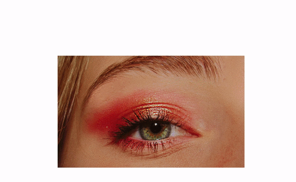

# VANILLA SKEW SCROLL 🦄

##### I started this new skew scroll to see if i encounter the same issues i am encountering with the react skew.

- I will see if it s possible to adapt this with a Component did mount in REACT

 <br>
 <br>
 <br>

##### REACT VERSION

[](https://github.com/nadiamariduena/react-smooth-skew-scrolling)

 <br>
 <br>
 <br>
  <hr>
 <br>
 <br>

### AT THIS POINT

```javascript
// 1
const section = document.querySelector("section");

//we use let because we are going to change this
// 2
let currentPixel = window.pageYOffset;
// 3
const looper = function () {
  //4
  const newPixel = window.pageYOffset;
  // 5
  const diff = newPixel - currentPixel;
  //
  // 8 take this difference/diff "each gap between the pixels" ..what this does is smoother the speed of the scroll
  const speed = diff * 0.25;
  //
  //
  section.style.transform = "skewY(10deg)";
  //
  //
  //  7  NOW WE NEED to overwrite THE currentPixel with the new pixel
  currentPixel = newPixel;
  //
  // here you need to tell what to run
  //   6
  requestAnimationFrame(looper);
};

// 7
looper();
```

> YOU WILL HAVE SOMETHING LIKE THIS

[]()

<br>
<br>

##### CHANGE THE FOLLOWING

```javascript
// the 10 deg is what makes the images and the text "section" skew to one side
section.style.transform = "skewY(10deg)";
```

##### FOR THIS

```javascript
//  + speed correspond to the const speed in step 8
//  You are adding astring to a const and a string
section.style.transform = "skewY(" + speed + "deg)";
```

<br>

##### AT THIS POINT it works BUT

- Its not exactly what i want because it dont seems smooth
- YOU WILL NEEED css

##### add the following styles 🌵

```css
section {
  width: 800px;
  /* will make it smooth */
  /*  const speed = diff * 1.5; */
  transition: transform 0.25s;
  /* will keep a tracker so it runs really quickly */
  will-change: transform;
}
```

<br>

##### RESULT

[]()

<br>
<br>

#### THE SKEW IS PERFECT FOR SMALL SECTION but I think I prefer the old one.

<br>
<br>

[SUPER HI skew scroll tutorial](https://www.superhi.com/library/posts/skew-on-scroll-effect)
